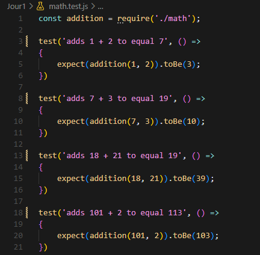

# **Test unitaire Jour 1** 

## Package.json:

```bash
npmm init -y
```

puis
```bash
npm install --save-dev jest
```


## Début des tests :

Fichier contenant la fonction :

- math.js :


Fichier contenant le test :

- math.test.js :


Premier test :


## Echec des tests :

Modification de math.js :


Lancement du second test et echec :


Correction de math.js :


Modification de math.test.js :




Resultat du test : 

 


