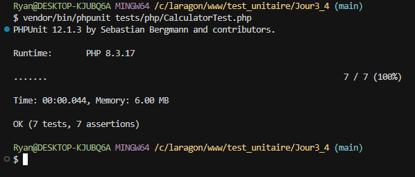
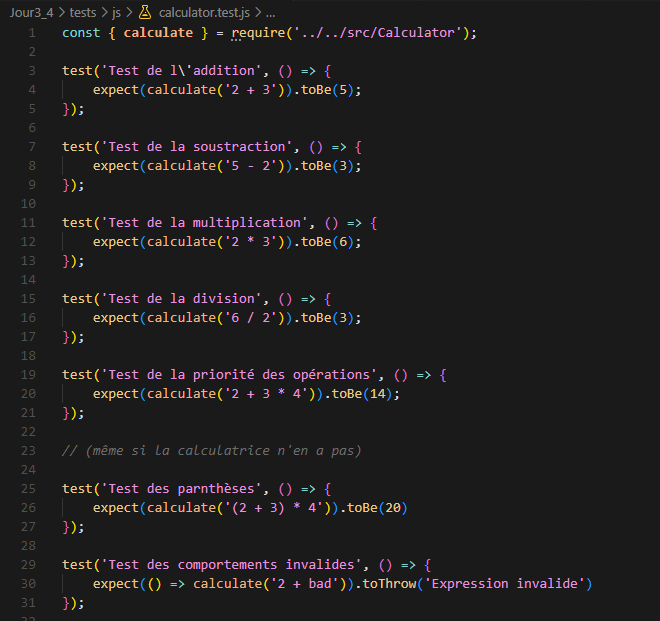
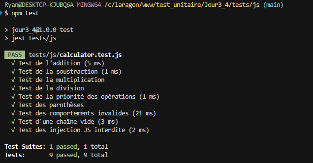
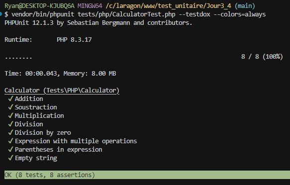

# **Test unitaire Jour 3&4 :** 

**1 - Modification des fichiers :**

- Modification de Calculator.php à la ligne 2 :
```php
namespace App;
```  
  
- Modification de Calculator_PHP.php à la ligne 30 :
```php
$calculator = new \App\Calculator();
```  

- Modification de l'autoloader de composer.json ligne 7 à 12 :
```json
 "autoload": {
        "psr-4": {
            "Test\\Unitaire\\": "src/",
            "App\\": "src/"
        }
    },
```  
  


**2 - Création de CalculatorTest.php :**


  


**3 - Lancement des tests PHP :**
```php
vendor/bin/phpunit tests/php/CalculatorTest.php
```
  


Résultat :


  


**4 - Création de calculator.test.js :**



  

**5 - Lancement des test JS:**

```js
npm test
```
  

Résultat :
 

  

**6 Resume des tests PHP :**




**7 Resume des tests JS :**


