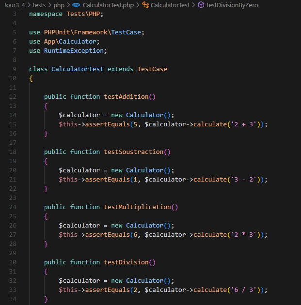

# **Test unitaire Jour 3&4 :** 

**1 - Modification des fichiers :**

- Modification de Calculator.php à la ligne 2 :
```php
namespace App;
```  
  
- Modification de Calculator_PHP.php à la ligne 30 :
```php
$calculator = new \App\Calculator();
```  

- Modification de l'autoloader de composer.json ligne 7 à 12 :
```json
 "autoload": {
        "psr-4": {
            "Test\\Unitaire\\": "src/",
            "App\\": "src/"
        }
    },
```

**Création de CalculatorTest.php :**




**Lancement des tests :**


